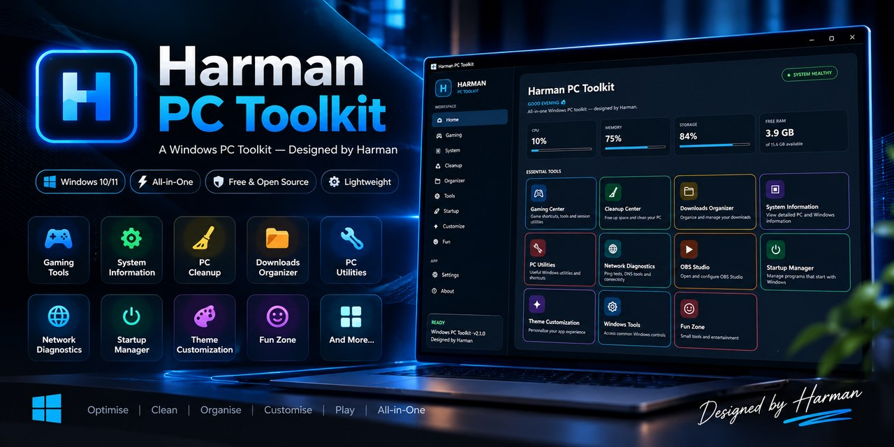

# Harman PC Toolkit



> A Windows PC Toolkit — Designed by Harman
> **Latest public release:** v2.1.0
>
> **A Windows PC Toolkit — Designed by Harman**

A practical Windows desktop toolkit for gaming, system management, cleanup, organization, diagnostics, startup visibility, customization, and everyday PC utilities.

## What’s new in v2.1.0

- New Harman PC Toolkit branding and tagline.
- Modern navy/blue WPF interface with a consistent visual language across the app.
- Redesigned Home dashboard with live system metrics and Essential Tools cards.
- Refreshed Gaming, System, Cleanup, Organizer, Tools, Startup, Customize, Fun, Settings, and About pages.
- Improved Startup Manager readability and spacing.
- Expanded Settings with startup behavior, local data controls, and official GitHub/update links.
- Existing application features remain available.

## Features

- Live Home dashboard: CPU, RAM, storage, free RAM, uptime, network and GPU name
- Gaming Center with session timer
- Persistent game shortcuts
- Steam / Epic / OBS launchers
- OBS configuration
- Game Mode / Display / Graphics / Network / Task Manager shortcuts
- Cleanup Center
- User temp cleanup
- Recycle Bin cleanup
- Windows Storage and Disk Cleanup shortcuts
- Downloads Organizer
- Largest-download scanner
- PC utility shortcuts
- Ping diagnostics and DNS flush
- Startup Manager
- Five dark themes
- Subtle hover effects
- Settings and start-with-Windows option
- Official GitHub repository and latest-release links
- Fun Zone
- Windows single-file publishing
- Inno Setup installer
- GitHub Actions CI and tag-based releases

## Download

Get the latest Windows installer from the official GitHub release:

https://github.com/harman7905/HarmanPCTools/releases/latest

The release page provides:

- `HarmanPCTools-Setup-2.1.0.exe` — installer
- `HarmanPCTools.exe` — portable single-file executable

## Requirements

- Windows 10 or Windows 11
- Visual Studio Community with WPF support for development
- .NET 8 SDK for building from source

## Run locally

Open `HarmanPCTools.sln` in Visual Studio.

Use:

`Build -> Rebuild Solution`

Then:

`Ctrl + F5`

## Publish a Windows executable

```powershell
.\scripts\publish.ps1
```

## Build the installer

Install Inno Setup 6, then:

```powershell
.\scripts\build-installer.ps1
```

## Public GitHub repository

https://github.com/harman7905/HarmanPCTools

## Release workflow

Releases are created from version tags. For a future release:

```powershell
git add .
git commit -m "Release Harman PC Toolkit 2.x.x"
git push origin main
git tag v2.x.x
git push origin v2.x.x
```

GitHub Actions builds the Windows portable executable and Inno Setup installer automatically.

## Updating later

For a future patch or feature release:

1. Update the version values in `HarmanPCTools.csproj`.
2. Update `CHANGELOG.md`.
3. Test locally.
4. Commit and push the changes.
5. Create and push the matching version tag.

## Safety

System-changing actions remain explicit. Cleanup asks for confirmation. Startup entries are shown rather than silently disabled. The application does not silently download or execute software updates.

## License

See [LICENSE](LICENSE).
