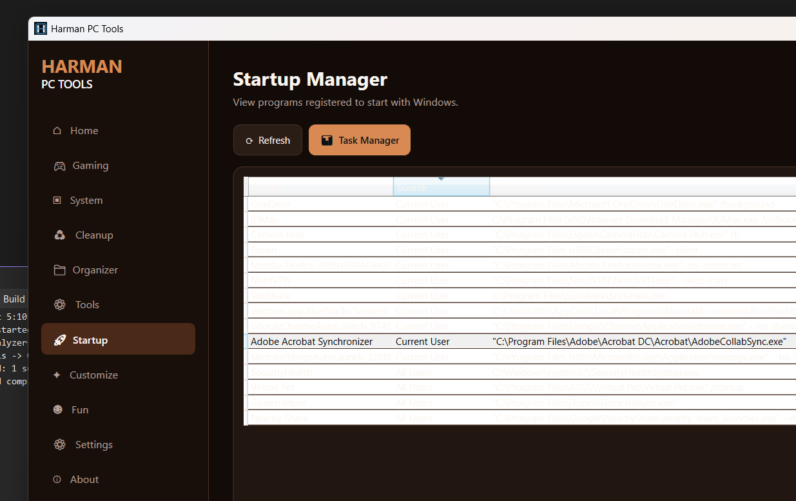

# Harman PC Tools

<p align="center">
  <strong>A practical Windows desktop toolkit for gaming, system management, cleanup, diagnostics, organization, startup visibility and customization.</strong>
</p>

<p align="center">
  <a href="https://github.com/harman7905/HarmanPCTools/releases/latest"></a>
  <a href="https://github.com/harman7905/HarmanPCTools/actions/workflows/windows-build.yml"></a>
  <a href="https://github.com/harman7905/HarmanPCTools/releases"></a>
  <a href="https://github.com/harman7905/HarmanPCTools/blob/main/LICENSE"></a>
</p>

<p align="center">
  <a href="https://github.com/harman7905/HarmanPCTools/releases/latest"><strong>Download Latest Release</strong></a>
  &nbsp;·&nbsp;
  <a href="https://github.com/harman7905/HarmanPCTools/issues">Report an Issue</a>
  &nbsp;·&nbsp;
  <a href="https://github.com/harman7905/HarmanPCTools/discussions">Discussions</a>
</p>

## Overview

Harman PC Tools brings frequently used Windows utilities into one focused WPF application. It is designed to make everyday PC maintenance and gaming tasks easier to find without trying to replace Windows itself.

The project is modular: features are grouped into pages and supported by small services, making future improvements and versioned releases easier to maintain.

## Features

| Area | Included |
| --- | --- |
| **Home** | CPU, RAM, storage, free RAM, uptime, network and GPU overview |
| **Gaming** | Game shortcuts, session timer, Steam, Epic Games, OBS and gaming-related Windows shortcuts |
| **System** | PC information and common system controls |
| **Cleanup** | User temp cleanup, Recycle Bin, Windows Storage and Disk Cleanup shortcuts |
| **Organizer** | Downloads organization tools and largest-download scanner |
| **Tools** | Task Manager, Device Manager, Event Viewer, Services, Disk Management, Control Panel, CMD, PowerShell and settings shortcuts |
| **Startup** | View programs registered to start with Windows |
| **Customize** | Five dark themes and appearance controls |
| **Settings** | Application preferences and optional start-with-Windows setting |
| **Diagnostics** | Ping test and DNS flush |
| **Fun** | Small built-in extras |

## Screenshots

### Startup Manager

The Startup Manager provides a clear view of programs registered to start with Windows while keeping the application theme consistent.



## Download

### Windows users

The easiest option is the installer from the latest GitHub release:

**[Download HarmanPCTools-Setup.exe](https://github.com/harman7905/HarmanPCTools/releases/latest)**

A portable single-file executable is also published with each release.

> The release artifacts are self-contained Windows builds, so end users do not need to install the .NET runtime separately.

## Build from source

### Requirements

- Windows 10 or Windows 11
- .NET 8 SDK
- Visual Studio with WPF/.NET desktop development, or a compatible `dotnet` CLI environment

### Run locally

```powershell
git clone https://github.com/harman7905/HarmanPCTools.git
cd HarmanPCTools

dotnet restore HarmanPCTools.sln
dotnet build HarmanPCTools.sln --configuration Debug
```

To launch from Visual Studio, open `HarmanPCTools.sln` and use **Ctrl+F5**.

### Publish a Windows executable

```powershell
.\scripts\publish.ps1
```

The published executable is written to `dist/publish`.

### Build the installer

Install **Inno Setup 6**, then run:

```powershell
.\scripts\build-installer.ps1
```

## Release workflow

Releases are versioned with Git tags. The repository includes GitHub Actions workflows that build a Windows self-contained executable and an Inno Setup installer for version tags.

Example:

```powershell
git add .
git commit -m "Improve feature"
git push origin main

git tag v2.0.3
git push origin v2.0.3
```

The `v2.0.3` tag triggers the release workflow.

See [`docs/RELEASE.md`](docs/RELEASE.md) for the complete release process.

## Project structure

```text
HarmanPCTools/
├── HarmanPCTools.sln
├── HarmanPCTools/
│   ├── Models/
│   ├── Pages/
│   ├── Services/
│   ├── Assets/
│   ├── App.xaml
│   ├── MainWindow.xaml
│   └── HarmanPCTools.csproj
├── docs/
├── installer/
├── scripts/
└── .github/workflows/
```

More detail is available in:

- [`docs/ARCHITECTURE.md`](docs/ARCHITECTURE.md)
- [`docs/DEVELOPMENT.md`](docs/DEVELOPMENT.md)
- [`docs/RELEASE.md`](docs/RELEASE.md)

## Safety and privacy

System-changing actions are explicit. Cleanup actions require confirmation, and startup entries are displayed rather than being silently disabled. The application does not self-update or silently execute downloaded code.

## Contributing

Bug reports, feature ideas and pull requests are welcome. See [`CONTRIBUTING.md`](CONTRIBUTING.md) before opening a contribution.

## License

See [`LICENSE`](LICENSE).

## Current release

**v2.0.2** — Startup Manager readability improvements plus the v2.0.1 compilation fixes.
